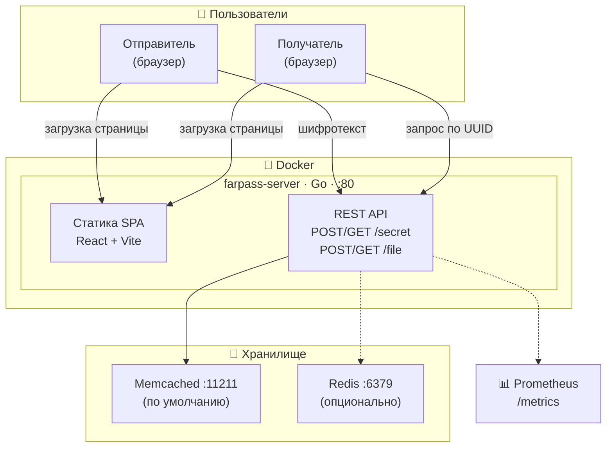
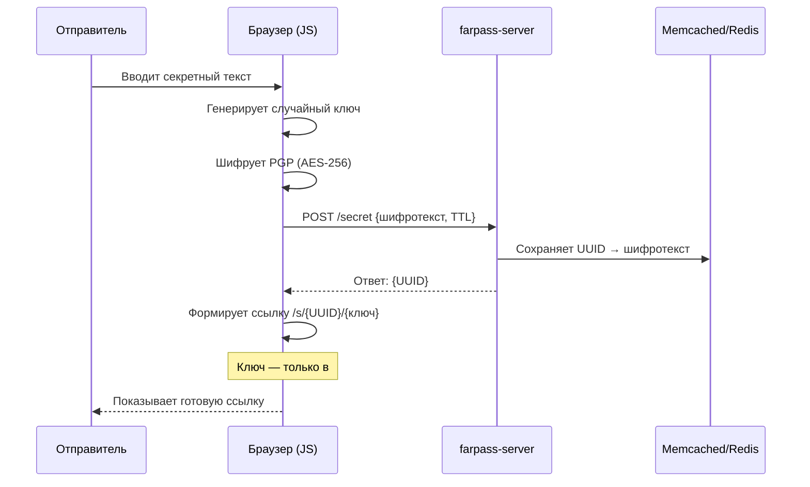
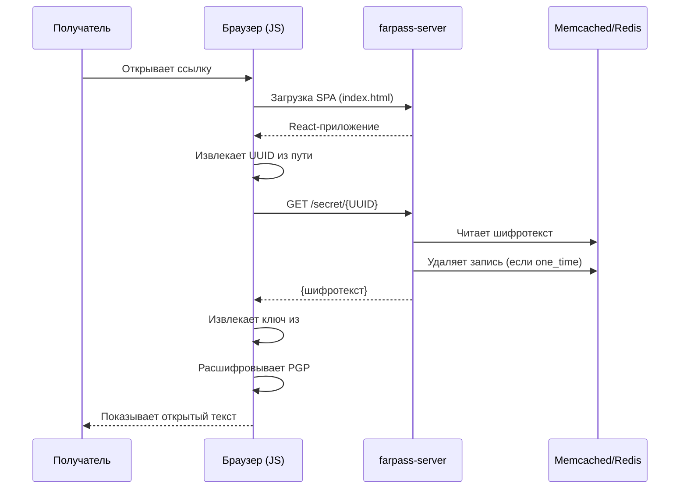
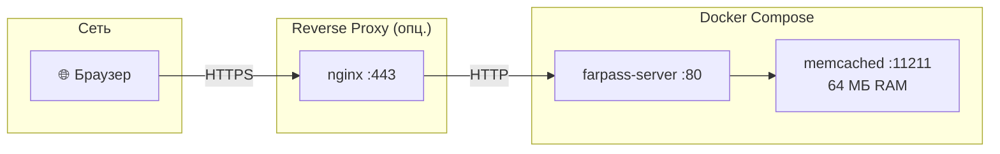

# FarPass — Архитектура

## Как устроен сервис

FarPass состоит из трёх частей: **фронтенд** (React SPA), **бэкенд** (Go API-сервер) и **хранилище** (Memcached или Redis). Весь процесс шифрования происходит в браузере — сервер работает только как «глупый сейф», который хранит зашифрованные конверты и отдаёт их по запросу.

---

## Общая архитектура

---

## Как отправляется секрет

---

## Как получается секрет

---

## Компоненты и стек

| Слой | Технология | Для чего |
|------|-----------|----------|
| **Фронтенд** | React 18 + TypeScript + Vite + Tailwind | SPA, шифрование в браузере через OpenPGP.js |
| **Бэкенд** | Go 1.24, Gorilla Mux | REST API, раздача статики, валидация PGP |
| **Хранилище** | Memcached (default) / Redis | Хранение шифротекста с TTL |
| **Шифрование** | OpenPGP.js (браузер), golang.org/x/crypto (CLI) | AES-256, PGP-формат |
| **Контейнер** | Docker multi-stage → distroless | Минимальный образ ~50 МБ |
| **Деплой** | Docker Compose / Kubernetes | Одна команда для запуска |
| **Мониторинг** | Prometheus (опционально) | HTTP-метрики, Go-рантайм |

---

## REST API

| Метод | Эндпоинт | Что делает |
|-------|----------|-----------|
| `POST` | `/secret` | Сохранить зашифрованный секрет |
| `GET` | `/secret/{key}` | Получить секрет (удаляет если одноразовый) |
| `GET` | `/secret/{key}/meta` | Метаинфо: одноразовый ли секрет |
| `POST` | `/file` | Сохранить зашифрованный файл |
| `GET` | `/file/{key}` | Получить файл |

---

## Инфраструктура (Docker Compose)

---

## Структура проекта

| Путь | Что внутри |
|------|-----------|
| `cmd/farpass/` | CLI-клиент — шифрует/дешифрует из терминала |
| `cmd/farpass-server/` | Точка входа API-сервера |
| `pkg/farpass/` | Ядро: `Encrypt()`, `Decrypt()`, HTTP-клиент |
| `pkg/server/` | Роуты, хэндлеры, интерфейс `Database`, реализации Memcached и Redis |
| `website/src/features/` | Страницы: создание секрета, загрузка файла, расшифровка |
| `website/src/shared/lib/` | `crypto.ts` (OpenPGP.js), `api.ts` (fetch к бэкенду) |
| `website/src/shared/locales/` | Переводы (i18n) |
| `website/tests/` | E2E-тесты (Playwright) |
| `deploy/` | Docker Compose (insecure / с TLS), Kubernetes-манифест |
| `Dockerfile` | Multi-stage: Go → Bun → distroless |

---

## Принцип безопасности

| На сервере **есть** | На сервере **нет** |
|---------------------|-------------------|
| Зашифрованный текст (PGP) | Открытый текст секрета |
| UUID ссылки | Ключ расшифровки |
| TTL (время жизни) | Информация об отправителе |
| Флаг одноразовости | Информация о получателе |
| | Логи содержимого |

> Ключ расшифровки находится **только** в URL-фрагменте (`#`), который браузер **не отправляет** на сервер — это стандарт HTTP.

---

<b>FarPass</b> · FARTECH · Farpost

